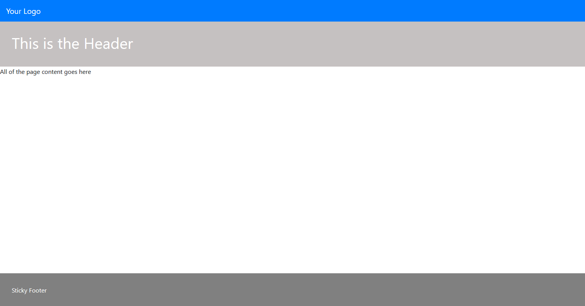

## Sticky Footer
The purpose of a footer is to stay at the bottom of the page despite the amount of content on the page. While this may sound simple, if you go about applying the wrong set of css classes to your page elements, you will end up with a hanging footer that is controlled by the content. That is, if the content is to be removed, the footer will find itself just under the header (if one exists).

In short, a sticky footer is one that will still hang to the bottom of the browser window despite the existence of content or amount of content. Ideally, we are trying to achieve the following:


In an attempt to cater for the compatability across all browsers, we will examine the use of both the *Grid Layout* and *Flexbox*.

### Using Grid
```
/*CSS Code: Start*/
.content-wrapper{
    min-height: 100vh;
    display: grid;
    grid-template-rows: auto 1fr auto;
}
/*CSS Code: End*/


<!--HTML Mockup: Start-->

<nav class="navbar navbar-expand-lg navbar-dark bg-primary">
    <a class="navbar-brand" href="/">
        Your Logo
    </a>
</nav>

<div class="content-wrapper">
    <header>
        This is the Header
    </header>

    <article class="page-body">
        All of the page content goes here
    </article>

    <footer class="page-footer">
        Sticky Footer
    </footer>
</div>
<!--HTML Mockup: End-->
```
### Using Flexbox
```
/*CSS Code: Start*/
.content-wrapper{
    min-height: 100vh;
    display: flex;
    flex-direction: column
}

.page-header, 
.page-footer{
    flex-shrink: 0;
}
.page-body {
    flex-grow: 1;
}
/*CSS Code: End*/
```

